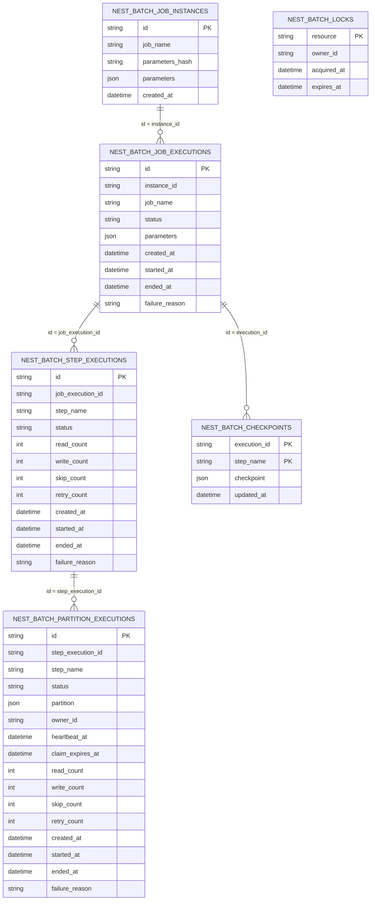

# Database Schema

이 문서는 `@nest-batch/postgres`, `@nest-batch/mysql`, `@nest-batch/mariadb` adapter가 생성하고 사용하는 durable batch schema를 설명한다.

현재 SQL adapter는 같은 논리 스키마를 공유한다. 차이는 identifier quoting, JSON 타입, timestamp 타입, schema/database qualification 정도에 있다.

## Adapter 생성 흐름

`PostgresBatchStorage`, `MySqlBatchStorage`, `MariaDbBatchStorage`는 `initialize()`에서 각각 `ensurePostgresSchema()`, `ensureMySqlSchema()`, `ensureMariaDbSchema()`를 호출한다.

기본 `tablePrefix`는 `nest_batch`다. 기본 테이블 이름은 다음과 같다.

- `nest_batch_job_instances`
- `nest_batch_job_executions`
- `nest_batch_step_executions`
- `nest_batch_partition_executions`
- `nest_batch_checkpoints`
- `nest_batch_locks`

Postgres는 `schema` option으로 schema를 지정할 수 있고, MySQL/MariaDB는 `database` option으로 database를 지정할 수 있다. `tablePrefix`를 바꾸면 모든 테이블 prefix가 함께 바뀐다.

## ERD

아래 ERD는 논리 관계를 보여준다. 현재 DDL은 물리적인 `FOREIGN KEY` 제약을 만들지 않고, repository가 id 컬럼으로 관계를 유지한다.

## 테이블 설명

### `nest_batch_job_instances`

동일한 `job_name`과 `parameters_hash` 조합을 하나의 job instance로 고정한다. 같은 job과 같은 parameters가 다시 실행되면 기존 instance를 기준으로 active execution 중복 여부와 restart 가능 여부를 판단한다.

| 컬럼 | 설명 |
| --- | --- |
| `id` | job instance id. |
| `job_name` | 실행 대상 job 이름. |
| `parameters_hash` | job parameters의 stable hash. |
| `parameters` | 원본 job parameters JSON. |
| `created_at` | instance 생성 시각. |

주요 제약과 index:

- Primary key: `id`
- Unique index/key: `(job_name, parameters_hash)`

### `nest_batch_job_executions`

job instance에 대한 실제 실행 시도를 저장한다. 하나의 instance는 여러 execution을 가질 수 있고, restart는 실패한 execution을 기준으로 새 execution을 만든다.

| 컬럼 | 설명 |
| --- | --- |
| `id` | job execution id. |
| `instance_id` | `job_instances.id`를 가리키는 논리 참조. |
| `job_name` | 조회와 운영 표시를 위한 job 이름 snapshot. |
| `status` | `created`, `running`, `completed`, `failed`, `cancelled`. |
| `parameters` | 실행 시점의 job parameters JSON. |
| `created_at` | execution 생성 시각. |
| `started_at` | 실행 시작 시각. |
| `ended_at` | 실행 종료 시각. |
| `failure_reason` | 실패 원인 문자열. |

주요 제약과 index:

- Primary key: `id`
- Index/key: `(job_name, status)`
- Index/key: `(instance_id, status, created_at)`

### `nest_batch_step_executions`

job execution 안에서 실행된 step 단위 상태와 처리량을 저장한다. restart 시 이전 실패 execution의 step 상태를 보고 이미 완료된 step을 건너뛸 수 있다.

| 컬럼 | 설명 |
| --- | --- |
| `id` | step execution id. |
| `job_execution_id` | `job_executions.id`를 가리키는 논리 참조. |
| `step_name` | step 이름. |
| `status` | `created`, `running`, `completed`, `failed`, `cancelled`. |
| `read_count` | 읽은 item 수. |
| `write_count` | 쓴 item 수. |
| `skip_count` | skip 처리된 item 수. |
| `retry_count` | retry 횟수. |
| `created_at` | step execution 생성 시각. |
| `started_at` | step 시작 시각. |
| `ended_at` | step 종료 시각. |
| `failure_reason` | 실패 원인 문자열. |

주요 제약과 index:

- Primary key: `id`
- Index/key: `(job_execution_id, step_name, status)`

### `nest_batch_partition_executions`

partitioned step의 개별 partition 실행 상태를 저장한다. worker는 `created` partition 또는 stale `running` partition을 claim하고, `owner_id`와 `heartbeat_at`으로 소유권과 생존 상태를 갱신한다.

| 컬럼 | 설명 |
| --- | --- |
| `id` | partition execution id. |
| `step_execution_id` | `step_executions.id`를 가리키는 논리 참조. |
| `step_name` | partition이 속한 step 이름. |
| `status` | `created`, `running`, `completed`, `failed`, `cancelled`. |
| `partition` | partition payload JSON. |
| `owner_id` | 현재 partition을 claim한 worker id. |
| `heartbeat_at` | worker heartbeat 시각. |
| `claim_expires_at` | claim 만료 예정 시각. |
| `read_count` | partition에서 읽은 item 수. |
| `write_count` | partition에서 쓴 item 수. |
| `skip_count` | partition에서 skip 처리된 item 수. |
| `retry_count` | partition에서 retry된 횟수. |
| `created_at` | partition execution 생성 시각. |
| `started_at` | partition 시작 시각. |
| `ended_at` | partition 종료 시각. |
| `failure_reason` | 실패 원인 문자열. |

주요 제약과 index:

- Primary key: `id`
- Index/key: `(step_execution_id, status, created_at)`

### `nest_batch_checkpoints`

chunk/tasklet step의 checkpoint를 저장한다. checkpoint는 성공적으로 처리된 chunk 경계 이후에만 저장된다.

| 컬럼 | 설명 |
| --- | --- |
| `execution_id` | checkpoint를 소유한 job execution id. |
| `step_name` | checkpoint가 속한 step 이름. |
| `checkpoint` | reader 또는 step이 반환한 checkpoint JSON. |
| `updated_at` | checkpoint 마지막 갱신 시각. |

주요 제약과 index:

- Primary key: `(execution_id, step_name)`

restart 시에는 최신 실패 execution의 checkpoint를 읽고, 새 execution이 진행되면서 새 `execution_id`로 checkpoint를 다시 쓴다.

### `nest_batch_locks`

분산 lock을 저장한다. 같은 `resource`에 하나의 owner만 lock을 가질 수 있다. TTL이 있는 lock은 만료 후 새 owner가 획득할 수 있고, 같은 owner는 lock을 갱신할 수 있다.

| 컬럼 | 설명 |
| --- | --- |
| `resource` | lock 대상 resource 이름. |
| `owner_id` | lock owner id. |
| `acquired_at` | lock 획득 또는 갱신 시각. |
| `expires_at` | lock 만료 시각. TTL이 없으면 `NULL`. |

주요 제약과 index:

- Primary key: `resource`
- Index/key: `expires_at`

## Dialect 차이

| 항목 | Postgres | MySQL | MariaDB |
| --- | --- | --- | --- |
| JSON 컬럼 | `JSONB` | `JSON` | `JSON` |
| timestamp 컬럼 | `TIMESTAMPTZ(3)` | `DATETIME(3)` | `DATETIME(3)` |
| id 컬럼 | `TEXT` | `VARCHAR(191)` | `VARCHAR(191)` |
| 상태 컬럼 | `TEXT` | `VARCHAR(32)` | `VARCHAR(32)` |
| 긴 오류 문자열 | `TEXT` | `TEXT` | `TEXT` |
| table qualification | `schema.table` | `database.table` | `database.table` |
| storage engine | database default | `InnoDB` | `InnoDB` |

MySQL/MariaDB에서 `partition` 컬럼은 reserved word 충돌을 피하기 위해 backtick으로 quote된다.

## 운영 메모

- 현재 schema bootstrap은 `CREATE TABLE IF NOT EXISTS` 기반이다. 운영에서 schema 변경이 필요한 버전 upgrade는 별도 migration 절차로 고정하는 편이 안전하다.
- DDL은 물리 `FOREIGN KEY`를 생성하지 않는다. batch runtime은 repository contract와 transaction 경계로 관계 정합성을 유지한다.
- `parameters`, `partition`, `checkpoint`는 JSON-serializable 값이어야 한다.
- partition claim과 distributed lock은 crash 이후 재처리를 허용하는 방향이다. writer는 중복 실행 가능성을 고려해 idempotent하게 작성해야 한다.
